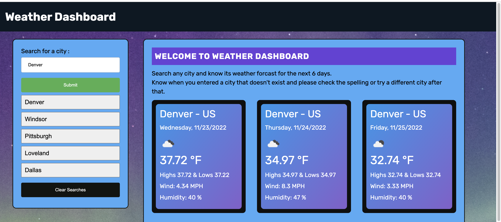

# Weather-App - Using Server Side APIs

## My Task

Following the user story below, I created an application that allows any user search for any city and know its' weather forcast for the next 5 days at the click of a button.

```
AS A traveler
I WANT to see the weather outlook for multiple cities
SO THAT I can plan a trip accordingly
```

## APP Features

> - Users can search any city and have the weather forcasts displayed on random cards.
> - Users will be notified when they search for a city that doesn't exist.
> - All the cards are dynamically generated and they will not be stacked on top of each other.

### Deployed Application

[Weather APP ](https://mo-aden.github.io/Weather-App/Develop/)

## APP Homepage UI


